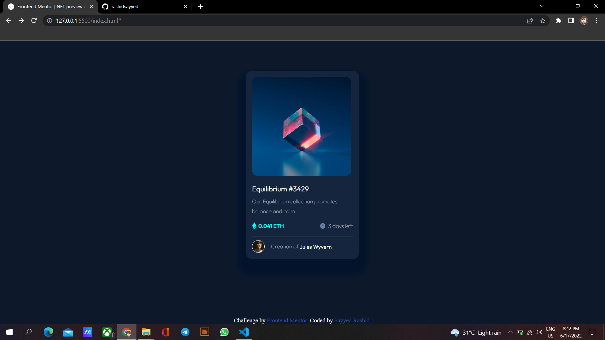

# Frontend Mentor - NFT preview card component solution

This is a solution to the [NFT preview card component challenge on Frontend Mentor](https://www.frontendmentor.io/challenges/nft-preview-card-component-SbdUL_w0U) By Sayyed Rashid. Frontend Mentor challenges help you improve your coding skills by building realistic projects. 


## Overview
This Challenge was fun to play with as it was my very first challenge.
### The challenge

Users should be able to:

- View the optimal layout depending on their device's screen size
- See hover states for interactive elements

### Screenshot



Add a screenshot of your solution. The easiest way to do this is to use Firefox to view your project, right-click the page and select "Take a Screenshot". You can choose either a full-height screenshot or a cropped one based on how long the page is. If it's very long, it might be best to crop it.

Alternatively, you can use a tool like [FireShot](https://getfireshot.com/) to take the screenshot. FireShot has a free option, so you don't need to purchase it. 

Then crop/optimize/edit your image however you like, add it to your project, and update the file path in the image above.


## My process
Open VsCode hit that live server and start throwing hands on design
### Built with

- Semantic HTML5 markup
- CSS custom properties
- Flexbox
- CSS Grid
- Mobile-first workflow
- [React](https://reactjs.org/) - JS library
- [Next.js](https://nextjs.org/) - React framework
- [Styled Components](https://styled-components.com/) - For styles

**Note: These are just examples. Delete this note and replace the list above with your own choices**

### What I learned

Below I'm putting the main html to make it more easy for you to have a look

To see how you can add code snippets, see below:

```html
<div class="main">
  
  <div class="container">
    <article class="mainimg">
      
      <div class="cyan-box">
        
      </div>
    </article>

    <h2>Equilibrium #3429</h2>
    
    <p>Our Equilibrium collection promotes balance and calm.
    </p>
  
    <ul>
      <li> 0.041 ETH</li>
      <li> 3 days left</li>
    </ul>
    <hr><article class="bot">

      <p> Creation of </p>&nbsp; <span id="na">Jules Wyvern</span>
    </article>
  </div>
  
</div>
```

## Author

- Frontend Mentor - [@yourusername](https://www.frontendmentor.io/profile/rashidsayyed)

